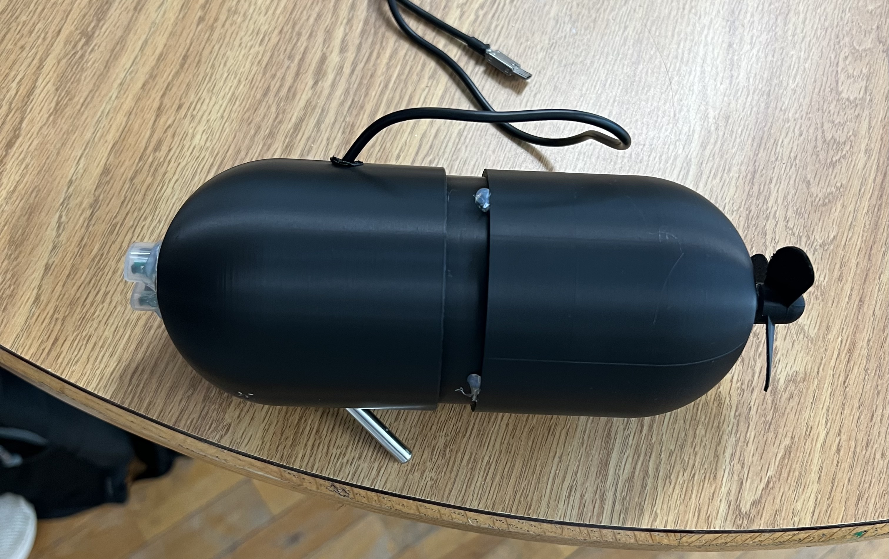

# NEMO

> **N**avigation and **E**nvironmental **M**apping **O**perations

An autonomous underwater sensor platform with a real-time oceanographic mission control dashboard. Built for [SMATHHacks 2026](https://smathhacks-2026.devpost.com/).



## What It Does

NEMO is an IoT-enabled submarine that collects environmental data — temperature, turbidity, and pH — and streams it to an interactive web dashboard. The dashboard provides a 3D/2D globe visualization with scientific ocean color mapping, float tracking, and click-to-measure capabilities.

## Project Components

### Hardware & Firmware

An ESP32 microcontroller reads from three sensors (DS18B20 temperature, analog turbidity, analog pH) and transmits JSON data over WiFi.

- [Arduino Firmware](arduino/sketch_mar14a/sketch_mar14a.ino)

### CAD

The submarine housing was designed in Onshape as a two-part shell enclosure.

- [Onshape CAD Model](https://cad.onshape.com/documents/635d94008a7b2e92a6e3f3a0/w/a783e7b1eb64d17fa37b633d/e/db1659edaf2e2cc9d925c934?renderMode=0&uiState=69b7111190569b2e7bee288f)
- [Shell 1 STEP File](cad/Submarine%20-%20Shell1.step)
- [Shell 2 STEP File](cad/Submarine%20-%20Shell2.step)

### Web Dashboard — Abyssal Mission Control

A canvas-based oceanographic dashboard featuring an interactive 3D globe, multi-variable visualization (SST, turbidity, pH), autonomous float trajectory tracking, and a mission control HUD.

- **Live Site:** [nemo-brown.vercel.app](https://nemo-brown.vercel.app)
- [Site Source Code](site/)

## Tech Stack

| Layer | Technologies |
|-------|-------------|
| **Hardware** | ESP32, DS18B20, analog pH & turbidity sensors, DC motor |
| **Firmware** | Arduino (C++), WiFi, HTTPClient |
| **Frontend** | Vanilla JS (ES6 modules), HTML5 Canvas 2D |
| **Deployment** | Vercel |

## Getting Started

```bash
# Run the dashboard locally
cd site
npm run dev
```

The Arduino firmware can be flashed to an ESP32 using the Arduino IDE. Update the WiFi credentials and server endpoint in the sketch before uploading.

## Team

- [**Tanuj**](https://tanujk.com/)
- [**Nate**](https://github.com/HappyAcccident)
- [**Trevor**](https://bedson.tech)

## License

This project is licensed under the [MIT License](LICENSE).
